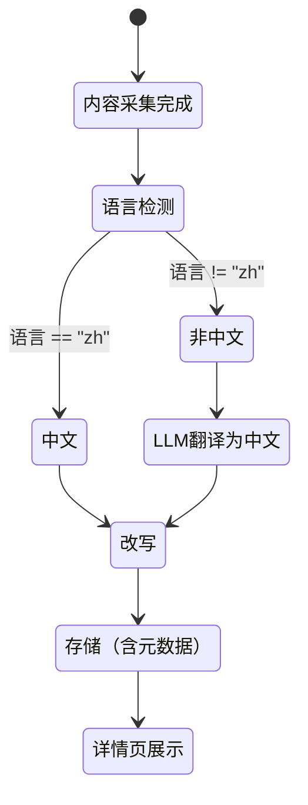

# Content Aggregator 功能迭代 PRD - v1.4.0

> **创建日期**：2026-06-08  
> **创建人**：QClaw (senior-pm skill)  
> **审批人**：待 PM 审核  
> **状态**：草稿  
> **关联项目**：PROJECT-001（热文采集改写平台）

> 📝 **版本说明**：本版本新增功能 17（非中文内容自动翻译并改写），由 senior-pm skill 按产品需求标准化流程输出。

---

## 一、背景与目标

### 1.1 背景

当前内容创作团队在热文采集和改写过程中存在以下痛点：
- 小红书/抖音等平台内容需手动整理，效率低
- 改写策略通用，无法按行业语境调整
- 内置策略固定，无法自定义保存
- 认证系统不统一，多项目无法复用
- 前端界面需要现代化改造
- 微信发布流程需要完善（封面管理、密码找回等）

### 1.2 目标

- 支持链接采集（小红书/抖音）并自动转写文案
- 支持行业定向改写，提升输出专业度
- 支持自定义改写策略管理，提升复用率
- 统一认证系统，支持多项目复用
- 完善微信发布流程（封面管理、密码找回）
- 优化前端界面和用户体验

### 1.3 成功指标

| 指标 | 目标值 |
|------|--------|
| 内容产出效率 | 提升 50%（篇/小时）|
| 改写质量满意度 | ≥ 85% |
| 策略复用率 | ≥ 60% |
| 用户认证成功率 | ≥ 99% |
| 微信发布成功率 | ≥ 95% |

---

## 二、用户故事

| 用户角色 | 场景 | 需求 |
|----------|------|------|
| 内容创作者 | 看到小红书/抖音爆款视频 | 希望粘贴链接直接获取文案，以免去手动整理 |
| 行业从业者 | 需要发布专业内容 | 希望改写时能指定目标行业，使输出更专业 |
| 重度用户 | 有多种改写风格需求 | 希望能保存多份改写策略并设默认，提升效率 |
| 系统管理员 | 管理多项目用户 | 希望统一认证系统，避免重复开发 |
| 微信公众号运营 | 发布文章到微信 | 希望完善封面管理、密码找回等功能 |
| 前端开发者 | 维护前端界面 | 希望现代化前端设计，提升用户体验 |

---

## 三、功能列表

### 3.1 已发布功能（v1.1.0 ~ v1.2.0）

| 功能 | 版本 | 状态 |
|------|------|------|
| 链接采集（小红书/抖音）| v1.1.0 | ✅ 已实现 |
| 文章改写-行业定向 | v1.1.0 | ✅ 已实现 |
| 文章改写-策略管理 | v1.1.0 | ✅ 已实现 |
| 微信公众号文章采集 | v1.2.0 | ✅ 已实现 |
| 知乎专栏采集 | v1.2.0 | 🚧 待实现 |
| 微信公众号草稿发布 | v1.2.0 | 🚧 待确认权限 |

### 3.2 新增功能（v1.3.0）

| 功能 | 优先级 | 状态 |
|------|--------|------|
| 统一认证系统复用 | P0 | 🚧 待实现 |
| 密码找回功能 | P1 | 🚧 待实现 |
| 封面选择集成到排版发布弹窗 | P0 | 🚧 待实现 |
| 图片模型设置页面 | P1 | 🚧 待实现 |
| 前端重设计「信息实验室」| P1 | 🚧 待实现 |
| 非中文内容自动翻译并改写 | P1 | ✅ 已实现 |
| API Key 预览功能 | P2 | 🚧 待实现 |
| 封面发布优先级链 | P0 | 🚧 待实现 |
| 默认封面管理 API + UI | P0 | 🚧 待实现 |
| 默认封面 media_id 缓存优化 | P2 | 🚧 待实现 |
| 发布报错修复 | P0 | ✅ 已修复 |

---

## 四、功能详情

### 功能 7：统一认证系统复用

#### 4.1 需求背景

当前 PROJECT-001、PROJECT-002、PROJECT-003 各自实现认证系统，代码重复，维护困难。需要将认证模块提取为共享模块，供多项目复用。

#### 4.2 实现方式

**共享模块路径**：`team/shared/auth/`

**包含功能**：
- JWT 鉴权
- 注册/登录/刷新
- 用户管理（CRUD）

#### 4.3 技术约束

| 项目 | 说明 |
|------|------|
| 依赖管理 | 使用 `team/shared/auth/requirements.txt` 管理依赖 |
| 接口规范 | 遵循 RESTful API 规范 |
| 安全性 | JWT Secret 需安全存储（环境变量或配置文件）|

#### 4.4 验收标准

- **Given** 用户访问 PROJECT-001 登录页面
  **When** 输入正确用户名密码
  **Then** 登录成功，跳转到首页

- **Given** 用户访问 PROJECT-002 登录页面
  **When** 输入正确用户名密码
  **Then** 登录成功，跳转到首页（使用同一套认证系统）

---

### 功能 8：密码找回功能

#### 4.1 需求背景

用户忘记密码时无法自行重置，需要联系管理员手动重置，体验差。

#### 4.2 实现方式

**新增页面**：
- `forgot_password.html`：输入注册邮箱
- `reset_password.html`：输入新密码（带 token 验证）

**业务流程**：
1. 用户点击「忘记密码」
2. 输入注册邮箱，系统发送重置链接（含 token）
3. 用户点击链接，跳转到重置密码页面
4. 输入新密码，提交
5. 系统验证 token（1h 有效期），更新密码

#### 4.3 技术约束

| 项目 | 说明 |
|------|------|
| Token 有效期 | 1h（3600 秒）|
| 邮件发送 | 使用 SMTP 或邮件服务 API |
| Token 存储 | Redis 或数据库 |

#### 4.4 API 设计

| 端点 | 方法 | 功能 |
|------|------|------|
| `/api/auth/forgot-password` | POST | 发送密码重置邮件 |
| `/api/auth/reset-password` | POST | 重置密码（验证 token）|

#### 4.5 验收标准

- **Given** 用户输入注册邮箱
  **When** 点击「发送重置邮件」
  **Then** 收到重置邮件（≤ 1min）

- **Given** 用户点击重置链接（token 有效）
  **When** 输入新密码，提交
  **Then** 密码重置成功，可使用新密码登录

- **Given** 用户点击重置链接（token 过期）
  **When** 输入新密码，提交
  **Then** 提示"重置链接已过期，请重新申请"

---

### 功能 9：封面选择集成到排版发布弹窗

#### 4.1 需求背景

当前封面选择独立于发布流程，用户需要单独上传封面，体验不流畅。

#### 4.2 实现方式

**修改页面**：`article_detail.html`（排版发布弹窗）

**新增区域**：封面选择区域（在发布按钮附近）

**支持方式**：
1. 选择已有封面（从封面库选择）
2. AI 生成封面（调用图片生成 API）
3. 上传新封面（本地上传）

#### 4.3 技术约束

| 项目 | 说明 |
|------|------|
| 封面库 | 复用现有封面表 |
| AI 生成 | 调用即梦/Vidu API |
| 发布接口 | 修改 `/api/publish/wechat` 支持 `cover_id` 参数 |

#### 4.4 验收标准

- **Given** 用户在排版发布弹窗
  **When** 选择「从封面库选择」
  **Then** 显示封面库弹窗，可选择已有封面

- **Given** 用户选择封面
  **When** 点击「发布」
  **Then** 文章发布到微信，使用选择的封面

---

### 功能 10：图片模型设置页面

#### 4.1 需求背景

当前图片生成模型配置分散，用户无法统一管理 API Key 和默认模型。

#### 4.2 实现方式

**修改页面**：`system-settings.html`（改名为「模型 API 设置」）

**新增区域**：图片生成模型区域

**支持功能**：
- 即梦/Vidu 预设
- API Key 管理（新增、编辑、删除）
- 默认模型切换

#### 4.3 技术约束

| 项目 | 说明 |
|------|------|
| API Key 存储 | 加密存储（不明文显示）|
| 模型预设 | 即梦、Vidu 等 |
| 默认模型 | 用户可选择默认模型 |

#### 4.4 API 设计

| 端点 | 方法 | 功能 |
|------|------|------|
| `/api/settings/image-models` | GET | 获取图片模型配置 |
| `/api/settings/image-models` | POST | 新增/更新图片模型配置 |

#### 4.5 验收标准

- **Given** 用户进入「模型 API 设置」页面
  **When** 查看图片生成模型区域
  **Then** 显示即梦/Vidu 预设、API Key 管理、默认模型切换

- **Given** 用户新增图片模型 API Key
  **When** 保存
  **Then** API Key 加密存储，不明文显示

---

### 功能 11：前端重设计「信息实验室」

#### 4.1 需求背景

当前前端界面风格陈旧，不符合现代审美，需要重新设计。

#### 4.2 设计方向

**美学方向**：信息实验室（高对比黑白 + 荧光绿 #00ff41 + 终端风格）

**新增文件**：`style-v2.css`

#### 4.3 实现方式

**修改文件**：
- `base.html`：引入 `style-v2.css`
- 各模板文件：逐步适配新样式

**注意事项**：
- 首次上线效果不佳（布局错乱），已回滚到旧样式
- 需要逐步适配各模板，避免一次性全部切换

#### 4.4 技术约束

| 项目 | 说明 |
|------|------|
| CSS 优先级 | 避免样式冲突 |
| 兼容性 | 支持现代浏览器 |
| 性能 | CSS 文件大小 ≤ 100KB |

#### 4.5 验收标准

- **Given** 用户访问首页
  **When** 页面加载完成
  **Then** 显示新样式（高对比黑白 + 荧光绿）

- **Given** 用户访问各功能页面
  **When** 页面加载完成
  **Then** 样式正常，无布局错乱

---

### 功能 12：API Key 预览功能

#### 4.1 需求背景

当前 API Key 输入框显示密文，他人可看到完整 Key，存在安全风险。

#### 4.2 实现方式

**修改页面**：`system-settings.html`

**显示规则**：
- 前 4 位明文 + `****`（如 `sk-1****`）
- 点击「显示」按钮，临时显示完整 Key（5s 后自动隐藏）

**保存逻辑**：
- 检测未改动则跳过 PUT 请求（避免不必要的 API 调用）

#### 4.3 技术约束

| 项目 | 说明 |
|------|------|
| 安全性 | 完整 Key 不明确显示 |
| 用户体验 | 支持临时显示 |
| 性能 | 减少不必要的 API 调用 |

#### 4.4 验收标准

- **Given** 用户查看 API Key 输入框
  **When** 页面加载完成
  **Then** 显示前 4 位明文 + `****`

- **Given** 用户点击「显示」按钮
  **When** 5s 内
  **Then** 显示完整 Key

- **Given** 用户未修改 API Key
  **When** 点击「保存」
  **Then** 跳过 PUT 请求，不调用 API

---

### 功能 13：封面发布优先级链

#### 4.1 需求背景

当前发布文章到微信时，封面选择逻辑不清晰，可能导致无封面发布。

#### 4.2 实现方式

**优先级链**（按顺序）：
1. 手动选择封面（用户主动选择）
2. 正文提取首张图片（自动提取）
3. 系统默认封面（本地存储）
4. 绿色占位图保底（避免无封面）

#### 4.3 技术约束

| 项目 | 说明 |
|------|------|
| 封面提取 | 支持 JPG/PNG/GIF |
| 封面上传 | 调用微信 API 上传封面 |
| 保底封面 | 绿色占位图（本地文件）|

#### 4.4 验收标准

- **Given** 用户发布文章到微信（已手动选择封面）
  **When** 点击「发布」
  **Then** 使用手动选择的封面

- **Given** 用户发布文章到微信（未手动选择封面，正文有图片）
  **When** 点击「发布」
  **Then** 自动提取正文首张图片作为封面

- **Given** 用户发布文章到微信（未手动选择封面，正文无图片）
  **When** 点击「发布」
  **Then** 使用系统默认封面

- **Given** 用户发布文章到微信（无封面可用）
  **When** 点击「发布」
  **Then** 使用绿色占位图保底

---

### 功能 14：默认封面管理 API + UI

#### 4.1 需求背景

当前系统默认封面无法管理，用户无法上传/删除默认封面。

#### 4.2 实现方式

**新增 API**：
- `POST /api/wechat/default-cover`：上传默认封面
- `GET /api/wechat/default-cover`：查询默认封面
- `DELETE /api/wechat/default-cover`：删除默认封面

**修改页面**：`wechat_settings.html`

**新增区域**：默认封面管理区域（上传、预览、删除）

#### 4.3 技术约束

| 项目 | 说明 |
|------|------|
| 封面存储 | 本地存储（文件系统）|
| 封面格式 | JPG/PNG/GIF |
| 封面大小 | ≤ 2MB |

#### 4.4 验收标准

- **Given** 用户进入微信设置页面
  **When** 查看默认封面管理区域
  **Then** 显示上传区域和预览

- **Given** 用户上传默认封面
  **When** 上传成功
  **Then** 显示封面预览

- **Given** 用户删除默认封面
  **When** 删除成功
  **Then** 封面预览消失

---

### 功能 15：默认封面 media_id 缓存优化

#### 4.1 需求背景

当前系统默认封面每次发布都上传到微信，产生重复临时素材，浪费 API 调用。

#### 4.2 实现方式

**缓存机制**：
- 缓存 media_id（2.5 天有效期）
- 过期自动重新上传
- 避免重复上传和 API 调用浪费

**存储方式**：
- Redis 或数据库

#### 4.3 技术约束

| 项目 | 说明 |
|------|------|
| 缓存有效期 | 2.5 天（60h）|
| 缓存更新 | 过期自动重新上传 |
| 缓存清理 | 手动清理（可选）|

#### 4.4 验收标准

- **Given** 用户发布文章到微信（使用系统默认封面）
  **When** 首次发布
  **Then** 上传封面到微信，获取 media_id，缓存

- **Given** 用户发布文章到微信（使用系统默认封面）
  **When** 2.5 天内再次发布
  **Then** 使用缓存的 media_id，不上传

- **Given** 用户发布文章到微信（使用系统默认封面）
  **When** 2.5 天后发布
  **Then** 重新上传封面，获取新 media_id，更新缓存

---

### 功能 16：发布报错修复

#### 4.1 问题描述

发布文章到微信时，存在两个阻断性 Bug：
1. `api_publish_article()` 函数内局部 `from pathlib import Path` 导致变量作用域冲突，选「从文章提取首图」时报错
2. `upload_thumb()` 接收文件路径但代码传 bytes（`f.read()`/`img_resp.content`），3 处传参错误

#### 4.2 修复方式

**修改文件**：`web/wechat_router.py`

**修复内容**：
1. 移除函数内局部的 `from pathlib import Path`，改为文件顶部导入
2. 修改 `upload_thumb()` 调用，传文件路径而非 bytes

#### 4.3 验收标准

- **Given** 用户发布文章到微信（选择「从文章提取首图」）
  **When** 点击「发布」
  **Then** 发布成功，无报错

- **Given** 用户发布文章到微信（选择「手动上传封面」）
  **When** 点击「发布」
  **Then** 发布成功，无报错

---

### 功能 17：非中文内容自动翻译并改写

#### 4.1 需求快照

- **需求类型**：[战术级] 现有改写流程的增强
- **需求概述**：采集到的非中文内容，在进入改写流程前先通过 LLM 翻译成中文，再执行改写，改写结果展示在文章详情页的改写后视图中
- **核心指标**：非中文内容覆盖率 ≥ 95%（能识别语言类型）、翻译后改写成功率 ≥ 90%

#### 4.2 业务逻辑

**角色 (Actors)**：
- Content Pipeline（内容处理流水线）：自动执行语言检测和翻译改写
- 用户（内容创作者）：在文章详情页查看翻译改写后的内容

**用例 (Use Case)**：
1. 采集到非中文内容 → 自动识别语言类型 → LLM翻译为中文 → 改写翻译后的内容 → 存储元数据（原文语言、翻译标记） → 文章详情页展示
2. 采集到中文内容 → 直接改写 → 正常展示

**状态机 (State Machine)**：



#### 4.3 功能详情

##### 4.3.1 语言检测模块

**修改文件**：新增 `processors/language_detector.py` 或复用 `processors/translator.py`

**检测方式**（二选一）：
- **方案A（推荐，零依赖）**：调用 LLM 判断内容语言，prompt 精简易懂，返回 ISO 语言代码（如 "en"、"ja"、"ko"）
- **方案B（轻量）**：使用 `langdetect` 或 `fasttext` 库，本地判断语言（更快但不支持所有语言）

**输出字段**：`detected_language`（ISO 639-1 代码，如 "en"）、`is_chinese`（bool）

##### 4.3.2 翻译模块扩展

**修改文件**：`processors/rewrite/rewriter.py`（现有 `RewriteConfig` 已有 `translate_to` 参数）

**现有能力**（已验证）：
- `RewriteConfig.translate_to="zh"` 时，改写 prompt 中插入「先翻译成中文再改写」指令
- 目前该参数仅在手动触发时传入，且 prompt 写死为「原文是英文」

**扩展内容**：
- 将固定「原文是英文」改为根据语言检测结果动态拼接（如「原文是日文」「原文是韩文」）
- 在改写 prompt 中增加语义说明：保持技术术语、专有名词不翻译；文化特定表达加括号注释
- 翻译结果与改写结果在同一个 LLM 调用中完成（不拆分两次调用），降低延迟和 token 消耗

##### 4.3.3 Pipeline 集成

**修改文件**：`workflows/pipeline.py`（`process_all_sources()` 和 `process_contents()`）

**修改点**：
- 在改写步骤前插入语言检测步骤
- 检测到非中文时，自动设置 `RewriteConfig.translate_to="zh"`
- 将语言检测结果写入 `article.metadata`

**触发方式**：
- **自动模式（默认）**：pipeline 运行时自动检测并处理，无需用户干预
- **手动模式**：在文章详情页保留「英文先翻译」复选框（已有），允许用户对单篇文章手动触发

##### 4.3.4 元数据字段

`article.metadata` 新增字段：

| 字段 | 类型 | 说明 |
|------|------|------|
| `original_language` | string | 原文语言代码（如 "en"、"ja"）|
| `original_language_name` | string | 原文语言中文名（如 "英语"、"日语"）|
| `translated_before_rewrite` | boolean | 是否经过翻译再改写 |

##### 4.3.5 文章详情页展示增强

**修改文件**：`web/templates/article_detail.html`

**修改点**：

1. **原文面板头部**：若 `article.metadata.original_language` 存在，显示语言标签
   ```html
   📄 原文
   <span class="badge" style="background:#4a6cf7;color:#fff;font-size:11px">
     {{ article.metadata.original_language_name }}
   </span>
   ```

2. **改写后面板头部**：若经过翻译，显示翻译提示标签
   ```html
   ✨ 改写后
   <span class="badge" style="background:#22c55e;color:#fff;font-size:11px">
     🌐 已翻译自 {{ article.metadata.original_language_name }}
   </span>
   ```

3. **非改写文章详情页**：改写按钮区域已有「英文先翻译」复选框 (#translateCheckbox)，不变

4. **文章列表页（articles.html）**：若为非中文文章，列表项中显示语言标签（可选增强）

##### 4.3.6 边界条件

| 场景 | 处理方式 |
|------|----------|
| 混合语言内容（中英混杂）| 视为中文，不翻译，直接改写 |
| 语言检测失败（不确定的语言代码）| 回退为中文，直接改写 |
| 内容为空或极短（≤ 20 字）| 跳过语言检测，直接改写 |
| LLM 调用超时或失败 | 跳过翻译步骤，直接改写原文（记录错误日志） |
| 无法识别的语言 | 回退为中文，直接改写 |

#### 4.4 数据与埋点

**核心埋点**：

| 事件名 | 属性 | 说明 |
|--------|------|------|
| `language_detected` | `language`, `content_id` | 语言检测完成 |
| `translated_before_rewrite` | `language`, `content_id`, `duration_ms` | 翻译完成 |
| `rewrite_translated` | `language`, `content_id`, `success` | 翻译后改写完成 |

**指标口径**：
- 非中文内容翻译覆盖率 = 翻译改写成功的非中文文章数 ÷ 采集到的非中文文章总数
- 翻译改写平均耗时 = 翻译耗时 + 改写耗时（ms）

#### 4.5 技术与约束

**修改文件清单**：

| 文件 | 变更类型 | 说明 |
|------|----------|------|
| `processors/rewrite/rewriter.py` | 修改 | 扩展 `translate_to="zh"` 逻辑，语言种类动态化 |
| `processors/rewrite/__init__.py` | 修改 | 导出新函数 |
| `workflows/pipeline.py` | 修改 | 改写步骤前插入语言检测 |
| `web/templates/article_detail.html` | 修改 | 原文/改写后面板显示语言标签 |
| 新增 `processors/language_detector.py` | 新增 | 语言检测模块 |

**性能要求**：
- 语言检测耗时 ≤ 3s（LLM 方案）或 ≤ 100ms（本地库方案）
- 翻译改写总耗时 ≤ 正常改写耗时 + 20%（单次 LLM 调用，非两次）

**兼容性**：
- 不影响现有中文内容的改写流程
- 不影响现有数据库和 API 接口

**安全合规**：
- 翻译内容与改写内容使用同一 LLM 密钥，无新增密钥管理

#### 4.6 验收标准 (GWT)

- **Given** 采集到一篇英文文章（标题/正文均为英文）
  **When** Pipeline 执行改写流程
  **Then** 自动检测为英文 → LLM 翻译为中文 → 改写 → 文章详情页显示「已翻译自 英语」标签

- **Given** 采集到一篇日文文章
  **When** Pipeline 执行改写流程
  **Then** 自动检测为日文 → LLM 翻译为中文 → 改写 → 文章详情页显示「已翻译自 日语」标签

- **Given** 采集到一篇中文文章（标题英文、正文中文的混合内容）
  **When** Pipeline 执行改写流程
  **Then** 检测为中文 → 直接改写 → 无翻译标签显示

- **Given** 用户查看文章详情页
  **When** 文章经过翻译改写
  **Then** 原文面板显示语言标签，改写后面板显示「已翻译自 XXX」标签

- **Given** 用户查看文章详情页（未改写文章）
  **When** 文章内容为英文
  **Then** 显示「英文先翻译」复选框（已有功能不变），勾选后触发翻译改写

#### 4.7 风险评估

| 风险 | 影响 | 应对措施 |
|------|------|----------|
| LLM 语言检测不准 | 中文内容被误判为非中文，多余翻译步骤 | 1. 加中文特征字符比例阈值（>50% 中文字符即判为中文）
2. 先用规则检测（CJK字符占比），规则判为中文字则跳过 LLM 检测 |
| 非中文内容量大时 LLM 成本增加 | Token 消耗上升 | 1. 翻译和改写在同一个 LLM 调用中完成
2. 可配置是否启用自动翻译 |
| 翻译质量影响改写质量 | 改写结果不如直改写中文内容 | 1. 翻译 prompt 强调保持技术术语
2. 提供不翻译直接改写的回退选项 |

---

## 五、非功能需求

### 5.1 性能

| 指标 | 目标值 |
|------|--------|
| 页面加载时间 | ≤ 2s |
| API 响应时间 | ≤ 500ms（非 AI 调用）|
| AI 调用响应时间 | ≤ 30s |

### 5.2 安全性

| 指标 | 目标值 |
|------|--------|
| API Key 加密存储 | 100% |
| JWT Token 有效期 | 7 天 |
| 密码找回 Token 有效期 | 1h |

### 5.3 兼容性

| 指标 | 目标值 |
|------|--------|
| 浏览器兼容 | Chrome、Firefox、Safari、Edge 最新版本 |
| 移动端适配 | 响应式布局 |

---

## 六、风险与依赖

### 6.1 风险

| 风险 | 影响 | 应对措施 |
|------|------|----------|
| 微信 API 权限不足 | 无法发布文章到微信 | 提前确认账号权限 |
| 即梦/Vidu API 不稳定 | 图片生成失败 | 提供保底方案（上传封面）|
| 前端重设计导致布局错乱 | 用户体验下降 | 逐步适配各模板 |

### 6.2 依赖

| 依赖 | 说明 |
|------|------|
| 微信公众号 API | 发布文章到微信 |
| 即梦/Vidu API | 图片生成 |
| JWT | 统一认证系统 |

---

## 七、排期建议

| 功能 | 预估工时 | 优先级 |
|------|----------|--------|
| 统一认证系统复用 | 8h | P0 |
| 密码找回功能 | 4h | P1 |
| 封面选择集成到排版发布弹窗 | 4h | P0 |
| 图片模型设置页面 | 3h | P1 |
| 前端重设计「信息实验室」| 12h | P1 |
| API Key 预览功能 | 2h | P2 |
| 封面发布优先级链 | 3h | P0 |
| 默认封面管理 API + UI | 4h | P0 |
| 默认封面 media_id 缓存优化 | 3h | P2 |
| 发布报错修复 | 1h | P0 |
| 非中文内容自动翻译并改写 | 6h | P1 |
| **合计** | **50h** |  |

---

## 版本更新记录

| 版本 | 日期 | 修改内容 | 修改人 |
|------|------|---------|--------|
| v1.1.0 | 2026-06-01 | 创建文档（链接采集、行业定向改写、改写策略管理） | QClaw (senior-pm skill) |
| v1.1.1 | 2026-06-07 | 按 PRODUCT-DOCS-STANDARD 规范更新头部格式，移入标准目录 | QClaw (CEO) |
| v1.1.2 | 2026-06-07 | 补充缺失章节（背景与目标、用户故事、非功能需求、风险与依赖），添加批注待 PM 审核 | QClaw (CEO) |
| v1.2.0 | 2026-06-07 | 新增功能 4~6（微信公众号采集、知乎专栏采集、微信草稿发布），新增问题改进章节，新增技术债务章节 | QClaw (CEO) |
| v1.3.0 | 2026-06-07 | 合并 INBOX 所有待处理需求（2026-06-01 ~ 2026-06-07），新增功能 7~16，优化现有功能 | QClaw (CEO) |
| v1.4.0 | 2026-06-08 | 新增功能 17：非中文内容自动翻译并改写（由 senior-pm skill 按产品需求标准化流程输出） | QClaw (senior-pm skill) |

---

*本文档由 CEO (QClaw) 手动更新，符合产品资料管理规范（PRODUCT-DOCS-STANDARD v1.0.0）。*

