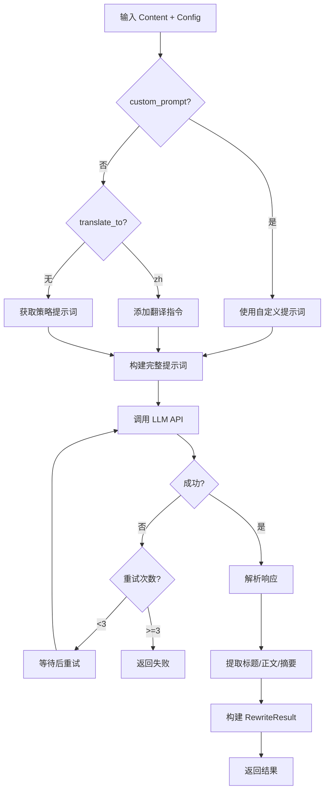

# 改写处理器规格

> 版本: 1.0.0  
> 最后更新: 2026-05-25  
> 状态: 反向工程自现有代码

---

## 1. 功能定义

将输入的 `Content` 对象改写为符合要求的文章内容。

### 1.1 输入/输出

```
输入: Content 对象 + RewriteConfig 配置
输出: RewriteResult 对象
```

---

## 2. 数据结构

### 2.1 RewriteConfig（改写配置）

```python
@dataclass
class RewriteConfig:
    strategy: RewriteStrategy      # 改写策略
    style_id: str | None          # 风格标识
    style_config: dict            # 风格配置
    min_word_count: int = 500     # 最小字数
    max_word_count: int = 5000    # 最大字数
    target_word_count: int = 3000 # 目标字数
    custom_prompt: str | None     # 自定义提示词（最高优先级）
    translate_to: str | None      # 翻译目标语言（"zh" 表示先翻译再改写）
```

### 2.2 RewriteResult（改写结果）

```python
@dataclass
class RewriteResult:
    success: bool                  # 是否成功
    original_content: Content      # 原始内容
    rewritten_content: str        # 改写后内容
    title: str                    # 改写后标题
    summary: str                  # 摘要
    keywords: list[str]           # 关键词
    error: str | None             # 错误信息
    duration: float               # 耗时（秒）
    metadata: dict                # 元数据
```

---

## 3. 改写策略

### 3.1 策略枚举

| 枚举值 | 标识 | 显示名称 | 说明 |
|--------|------|----------|------|
| `SUMMARIZE` | `summarize` | 摘要提取 | 提取核心要点，200-500 字 |
| `STYLE_TRANSFER` | `style_transfer` | 风格迁移 | 改变写作风格 |
| `PARAPHRASE` | `paraphrase` | 伪原创 | 同义替换，保持结构 |
| `REWRITE` | `rewrite` | 深度改写 | 重新组织结构 |
| `EXPAND` | `expand` | 内容扩展 | 添加背景案例 |
| `SHORT_VIDEO` | `short_video` | 短视频文案 | 口语化脚本 |

### 3.2 默认提示词

#### SUMMARIZE
```
你是一个专业的文章摘要助手。请根据提供的文章内容,提取核心要点,生成简洁准确的摘要。
直接输出结果，不要任何寒暄或前缀。
要求：
1. 保留关键信息和核心观点
2. 语言简洁流畅
3. 长度控制在200-500字
4. 使用中文输出
```

#### REWRITE（默认策略）
```
你是一个专业的文章改写助手。请对原文进行深度改写,重新组织结构和表达方式。
要求：
1. 保持原文的核心信息和主要观点
2. 重新组织文章结构和段落
3. 改变表达方式和句式
4. 使用中文输出
5. 同时改写标题，在正文前用【标题】标记改写后的标题
6. 直接输出改写结果，不要任何寒暄、解释或前缀
```

#### SHORT_VIDEO（短视频文案）
```
你是一名专业的短视频文案仿写专家，具备以下核心能力：
- 精准识别爆款短视频文案的选题角度和内容结构
- 保持40%-50%内容相似度的改写技巧
- 自然融入用户提供的替换信息
- 完美复现短视频特有的口语化、情感化表达风格

【仿写核心要求】
1. 选题一致性 - 完全保持原文案的核心主题方向
2. 结构还原度 - 段落数量和组织顺序完全一致
3. 内容相似度控制 - 保持40%-50%的内容相似度
4. 风格优化 - 保持口语化表达和情感化语言
```

---

## 4. 行为流程

### 4.1 单篇改写流程



### 4.2 批量改写流程

```
输入: Content 列表
并发控制: 信号量（默认 3 并发）
输出: RewriteResult 列表

处理逻辑:
1. 初始化信号量（控制并发数）
2. 为每个 Content 创建异步任务
3. 使用 semaphore 限制并发
4. gather 收集所有结果
5. 处理异常（转为失败结果）
6. 返回结果列表
```

---

## 5. 提示词构建规则

### 5.1 提示词优先级

```
1. RewriteConfig.custom_prompt（最高）
   ↓
2. config.yaml → rewrite.prompts[strategy]
   ↓
3. RewriteProcessor.DEFAULT_PROMPTS[strategy]（最低）
```

### 5.2 提示词结构

```
[系统指令/策略提示词]
[风格配置]（可选）
[字数要求]
[原文内容]
```

### 5.3 翻译指令注入

当 `translate_to="zh"` 时，在系统提示词前添加：
```
【重要】原文是英文，请按以下步骤处理：
第一步：先将全文翻译成流畅的中文（保留原文的技术术语）。
第二步：对翻译后的中文内容按以下要求进行改写。
---
```

---

## 6. LLM 调用规格

### 6.1 请求参数

```python
{
    "model": config.get("model", "deepseek-chat"),
    "messages": [{"role": "user", "content": prompt}],
    "max_tokens": config.get("max_tokens", 4096),
    "temperature": 0.7
}
```

### 6.2 重试策略

```
重试次数: 3 次
退避策略: 指数退避（2^attempt 秒）
触发条件:
  - HTTP 429（Rate Limited）
  - 网络超时
  - 服务端错误（5xx）
```

### 6.3 错误处理

```
API Key 缺失 → 直接失败
HTTP 429 → 等待后重试
HTTP 5xx → 重试
其他错误 → 记录日志，返回失败结果
```

---

## 7. 响应解析规格

### 7.1 标题提取

```python
# 匹配模式
patterns = [
    r"【标题】[::]?\s*(.+?)(?:\n|$)",
    r"标题:\s*(.+?)(?:\n|$)"
]
```

### 7.2 正文提取

```
1. 移除【标题】、【摘要】、标题:、摘要: 等标记
2. 清理寒暄前缀（如"好的，这是为您改写的文章："）
```

### 7.3 摘要提取

```python
# 匹配模式
patterns = [
    r"【摘要】[::]?\s*(.+?)(?:\n【|\n\n|$)",
    r"摘要:\s*(.+?)(?:\n【|\n\n|$)"
]

# 默认行为：截取正文前 200 字
```

---

## 8. 元数据规格

### 8.1 必需字段

```python
metadata = {
    "strategy": config.strategy.value,
    "original_length": len(original_content.content),
    "rewritten_length": len(rewritten_content),
    "word_count": len(rewritten_content),
    "rewritten": True,
    "translate_to": config.translate_to
}
```

### 8.2 可选字段（来自 LLM 响应）

```python
if usage:
    metadata["tokens_used"] = usage.get("total_tokens", 0)
    metadata["prompt_tokens"] = usage.get("prompt_tokens", 0)
    metadata["completion_tokens"] = usage.get("completion_tokens", 0)
```

---

## 9. 使用示例

### 9.1 基本用法

```python
from content_aggregator.processors.rewrite import RewriteProcessor, RewriteConfig
from content_aggregator.models import Content

content = Content(
    id="test-001",
    source_id="rss",
    source_type="rss",
    url="https://example.com/article",
    title="原标题",
    content="原文内容..."
)

async with RewriteProcessor(config) as processor:
    result = await processor.rewrite(content)
    
    if result.success:
        print(f"标题: {result.title}")
        print(f"正文: {result.rewritten_content}")
```

### 9.2 自定义提示词

```python
config = RewriteConfig(
    strategy=RewriteStrategy.REWRITE,
    custom_prompt="请将文章改写为小红书风格...",
    target_word_count=1500
)

result = await processor.rewrite(content, config)
```

### 9.3 批量改写

```python
contents = [content1, content2, content3]
results = await processor.rewrite_batch(contents)

for r in results:
    if r.success:
        print(f"✓ {r.title}")
    else:
        print(f"✗ {r.error}")
```

---

## 10. 已知问题

| 问题 | 状态 | 影响 |
|------|------|------|
| LLM 偶尔输出寒暄前缀 | ✅ 已修复 | 清理逻辑已添加 |
| 标题提取失败 | ⚠️ 已知 | 降级使用原标题 |
| 批量改写异常未捕获 | ✅ 已修复 | 转为失败结果 |
